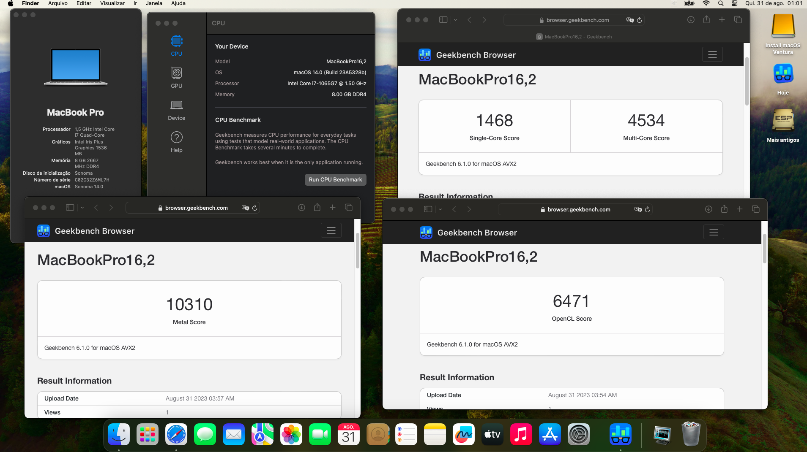

# Lenovo IdeaPad S145 (Ice Lake) Hackintosh 2023

EFI para Lenovo IdeaPad S145 OpenCore Bootloader

Compativel com Lenovo Ideapad S145 10.º Geração Ice Lake com os processadores i3-1005G1 UHD, i5-1035G1 UHD e i7-1065G7 Intel® Iris® Plus Graphics.

                                         
### Laptop Especificações:

| Component        | Brank                              |
| ---------------- | ---------------------------------- |
|                                                       |
| CPU              | Intel i7 1065G7 (4C-8T 8MB ICL)    |
| iGPU             | Intel® Iris Plus Graphics          |
| Audio            | Realtek ALC230                     |
| Ram              | 8 GB DDR4 2667 Mhz                 |
| Wifi + Bluetooth | BCM94360CS2                        |
| SmBios           | MacBookPro 16,2                    |
| BootLoader       | OpenCore 0.9.4                     |
| macOS            | Ventura 13.5.1 / Sonoma Beta 6     |

### O que funciona 100%?

- iGPU (excepto saída HDMI)
- Total ALC230 (Som e microfone) ALC ID layout 20
- Sleep / Wake
- I2C Touchpad com gestos (ELAN & SYNA)(Modo Polling)
- Teclado (PS2)
- Teclas de brilho e volume
- Wi-Fi & Bluetooth BCM94360NG
- Leitor Micro SD 
- WebCam (Monterey > talvez precise ManyCam modo 240p / Ventura > iPhone Camera pode ser uma solução)
- ACPI Bateria
- NVRAM (Nativa para i7/bios mod)
- Recovery (macOS) boot do OpenCore

### Special Config:

- Device ID nativo (0200518A) Fully Graphic and Sleep/Wake.
- USB port mapping performed
- [Maldon](olarila.com) ACPI fix

## Install

- Before Install, you must change your bios (mandatory) 👉 [BIOS MOD Tutorial](https://www.youtube.com/watch?v=i5AYuSpQNYY&t=0s)
- [Install Procedures](https://www.youtube.com/watch?v=_fNvIfPxOEA&t=0s)

## Tips

- Use ManyCam (ou um app de terceiro que permita alterar a resolução da WebCam para 240p) caso a camera perca suporte no Monterey. Ventura possui novos features com a camera do iPhone;
- [BIOS MOD Tutorial](https://www.youtube.com/watch?v=i5AYuSpQNYY&t=0s)
- [HiDPI Retina Display](https://www.youtube.com/watch?v=_fNvIfPxOEA&t=0s)

## Warning

Não me responsabilizo por danos. Sempre faça Backup;

## Credits

- [Apple](https://apple.com/osx) for macOS.
- [Acidanthera](https://github.com/acidanthera) for OpenCore and some kexts
- [Mald0n](https://www.olarila.com/topic/9918-olarila-hackintosh-hackbook-lenovo-ideapad-s145-10th-gen-catalina-big-sur-monterey-full-dsdt-patches-clover-and-opencore) for EFI bases, Olarila Vanilla Images, DSDT and Support!

## Geekbench Links

- [CPU](https://browser.geekbench.com/v6/cpu/2447662)
- [GPU Metal](https://browser.geekbench.com/v6/compute/866832)
- [GPU OpenCL](https://browser.geekbench.com/v6/compute/866826)
